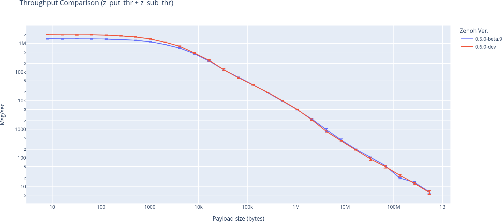
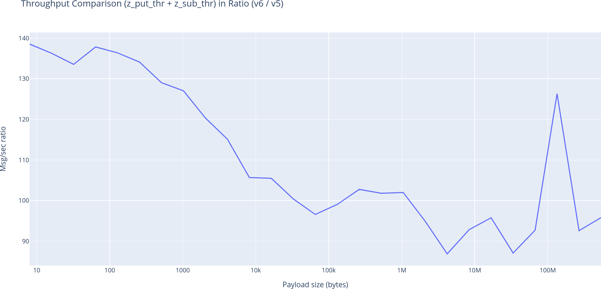

# Zenoh Perf Upgrade

This repo aims to upgrade the version of [zenoh-perf](https://github.com/atolab/zenoh-perf)
from v0.5.0.beta9 to v0.6.0

## Throughput

### Progress

- [x] z_put_thr
- [x] z_sub_thr
- [ ] zn_pub_thr
- [ ] zn_sub_thr
- [ ] zn_sub_thr_stream
- [ ] r_pub_thr
- [ ] r_sub_thr
- [ ] t_pubsub_thr
- [ ] t_pub_thr
- [ ] t_router_thr
- [ ] t_sink_tcp
- [ ] t_sink_udp
- [ ] t_sub_thr

## Usage

Download [zenoh-perf v0.5.0-beta9](https://github.com/atolab/zenoh-perf),
build it, and specify the path in `./config/v5.sh`.

Run peer-to-peer testing for Zenoh 0.5.0-beta9

```
./p2p.sh ./config/v5.sh
```

Run peer-to-peer testing for Zenoh 0.6.0-dev

```
./p2p.sh ./config/v6.sh
```

## Results

Throughput Comparison



Throughput Comparison in Ratio


